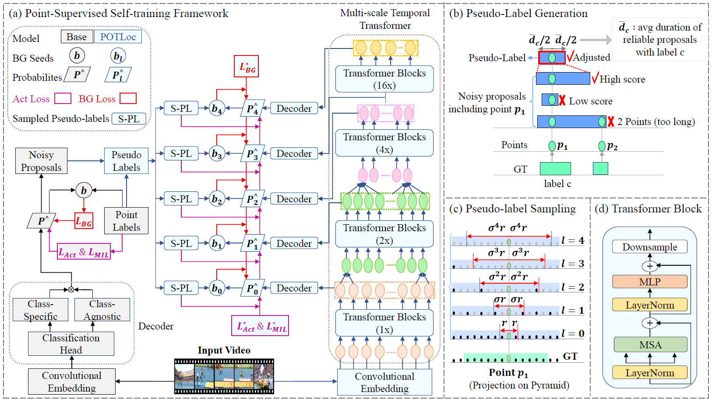

# POTLoc
### Official Pytorch Implementation of '[POTLoc: Pseudo-Label Oriented Transformer for Point-Supervised Temporal Action Localization](https://arxiv.org/pdf/2310.13585.pdf)' 

> **POTLoc: Pseudo-Label Oriented Transformer for Point-Supervised Temporal Action Localization** 
> Elahe Vahdani, Yingli Tian
>
> Paper: https://arxiv.org/pdf/2310.13585.pdf
>
> **Abstract:** *This paper tackles the challenge of point-supervised temporal action detection, wherein only a single frame is annotated for each action instance in the training set. Most of the current methods, hindered by the sparse nature of annotated points, struggle to effectively represent the continuous structure of actions or the inherent temporal and semantic dependencies within action instances. Consequently, these methods frequently learn merely the most distinctive segments of actions, leading to the creation of incomplete action proposals. This paper proposes POTLoc, a Pseudo-label Oriented Transformer for weakly-supervised Action Localization utilizing only point-level annotation. POTLoc is designed to identify and track continuous action structures via a
self-training strategy. The base model begins by generating action proposals solely with point-level supervision. These proposals undergo refinement and regression to enhance the precision of the estimated action boundaries, which subsequently results in the production of `pseudo-labels' to serve as supplementary supervisory signals. The architecture of the model integrates a transformer with a temporal feature pyramid to capture video snippet dependencies and model actions of varying duration. The pseudo-labels, providing information about the coarse locations and boundaries of actions, assist in guiding the transformer for enhanced learning of action dynamics. POTLoc outperforms the state-of-the-art point-supervised methods on THUMOS'14 and ActivityNet-v1.2 datasets, showing a significant improvement of 5% average mAP on the former.*

## Prerequisites
### Recommended Environment
* Python 
* Pytorch 
* Tensorflow 
* CUDA 

### Depencencies
Instructions for Setting Up the Environment:
    conda env create -f environment.yml
    conda activate environment_name
    pip install -r pip_requirements.txt
    If you encounter any version conflicts or other installation issues, they may need to be addressed manually. This can involve adjusting package versions or resolving dependencies.

### Data Preparation
1. Prepare [THUMOS'14](https://www.crcv.ucf.edu/THUMOS14/) dataset.
    - We excluded three test videos (270, 1292, 1496) as previous work did.

2. Extract features with two-stream I3D networks
    - We recommend extracting features using [this repo](https://github.com/piergiaj/pytorch-i3d).
    - For convenience, we provide the features we used. You can find them (here)
    
3. Place the features inside the `dataset` folder.
    - Please ensure the data structure is as below.
   
~~~~
├── dataset
   └── THUMOS14
       ├── gt.json
       ├── split_train.txt
       ├── split_test.txt
       ├── fps_dict.json
       ├── point_gaussian
           └── point_labels.csv
       └── features
           ├── train
           └── test
~~~~

## Usage

### Running
You can easily train and evaluate the model by running the script below.
If you want to try other training options, please refer to `config.py`.
The pre-trained model can be found (here)
~~~~
$ python run.py
~~~~

## Citation
If you find this code useful, please cite our paper.

~~~~
@article{vahdani2023potloc,
  title={POTLoc: Pseudo-Label Oriented Transformer for Point-Supervised Temporal Action Localization},
  author={Vahdani, Elahe and Tian, Yingli},
  journal={arXiv preprint arXiv:2310.13585},
  year={2023}
}
~~~~

## Contact
If you have any question or comment, please contact the first author of the paper - Elahe Vahdani (evahdani@gradcenter.cuny.edu).
